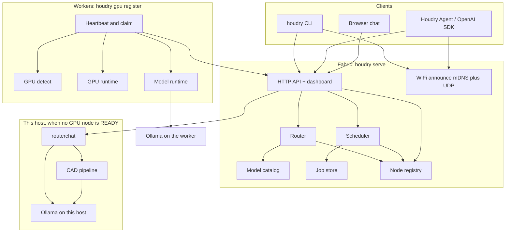
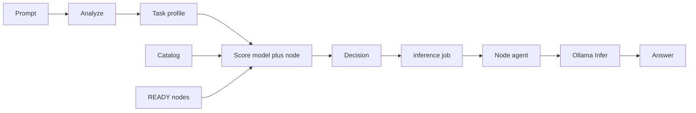

# Houdry

Houdry is a private GPU fabric. It finds GPUs on machines you already own, joins those machines into a cluster, picks a local model for each request, and runs inference on the chosen node. Work stays on your network. There is no cloud LLM API in the path.

This repository is the fabric: a single Go CLI that is the control plane and the worker agent. End-user chat lives in a separate product, [Houdry Agent](https://github.com/houdry-genomex/houdry-agent), which talks to this fabric over the OpenAI-shaped `/v1` API.

## What it does

- Discovers GPUs (NVIDIA, AMD, and platform inventory on Linux, Windows, and macOS) and reports a normalized inventory.
- Announces the control plane on the local WiFi so GPU nodes and Houdry Agent can find it without typing an IP.
- Runs a control plane (`houdry serve`) that registers nodes, stores jobs on disk, and serves a cluster dashboard.
- Runs a node agent (`houdry gpu register`) that heartbeats, claims jobs, and executes them. Local and remote workers use the same HTTP APIs.
- Schedules two job types: `gpu.smoke` (runtime liveness probe) and `inference` (generate text through a model runtime).
- Routes a prompt by analyzing it (modality, complexity, capabilities), matching it against a model catalog, and scoring `(model, node)` pairs. Prefer a loaded, right-sized model on a READY node.
- Exposes `POST /v1/chat/completions` so OpenAI SDKs and Houdry Agent can use the fabric. `model=auto` runs the router; a named model pins that model. With no READY GPU node, the same endpoint talks to Ollama on this machine (live token streaming, vision, CAD) instead of queuing a cluster job.
- `houdry route --local` is a terminal bench against this machine's Ollama. Chat, streaming, and CAD go through `houdry serve`.

The working model runtime is Ollama. vLLM and llama.cpp adapters exist as stubs (`Available` is always false).

## Architecture



Two processes matter:

1. **Control plane** (`houdry serve`). Holds the node list, the job queue, and the catalog. On `POST /v1/route` or `POST /v1/chat/completions` with a READY GPU node it decides a model and node, creates an `inference` job, and waits for a worker to finish it (streaming on that path buffers the full answer). With no READY GPU node it runs the same `/v1` against Ollama on this machine: live token streaming, vision, and the drawing→STEP CAD pipeline. Generated files are served at `/files/`.
2. **Compute** (`houdry gpu register`). One process per GPU machine. Detect first (`houdry gpu detect`), then register. It finds the control plane on WiFi, stays running, and logs when work arrives from Houdry Agent. Ctrl+C drains, waits for the current job, then leaves. `--server` still works as an override. `houdry node join` is the same command.

`houdry route --local` / `--interactive` is a terminal bench against this machine's Ollama. It does not start a second HTTP server.

### Request path



Analyze is a heuristic, not an LLM. It looks at keywords, length, code fences, vision/document cues, and (on the OpenAI path) whether tools were sent. Complexity is a 0-100 score bucketed into low / medium / high.

Scoring prefers:

- a model whose max complexity matches the task (avoid a 14B for "hi")
- overlapping capabilities (chat, code, reasoning, vision, tools)
- LOADED in VRAM over merely on disk over a pull
- enough free VRAM
- tool-capable models when the client sent tools
- vision-capable models when an image is attached; otherwise the decision defers instead of handing pixels to a text model

If the top candidate fails, the local router retries the next ranked candidate (up to 3). The fabric job path does not do that failover.

### Node and job states

Nodes: JOINED (inventory snapshot only, not schedulable), READY, BUSY, DRAINING, OFFLINE (stale heartbeat).

Jobs: queued, pending (assigned, waiting for claim), running, succeeded, failed.

## Install

GitHub latest release into `~/.houdry/bin`:

Linux / macOS:

```bash
curl -fsSL https://github.com/houdry-genomex/houdry/releases/latest/download/install.sh | sh
export PATH="$HOME/.houdry/bin:$PATH"
houdry version
houdry gpu detect
```

Windows PowerShell:

```powershell
irm https://github.com/houdry-genomex/houdry/releases/latest/download/install.ps1 | iex
& "$HOME\.houdry\bin\houdry.exe" version
& "$HOME\.houdry\bin\houdry.exe" gpu detect
```

`houdry serve` listens on `0.0.0.0:8080` unless you pass `--listen`. Examples below use that default. Set `HOODRY_SERVER` and optional `HOODRY_TOKEN` so CLI commands do not need `--server` every time. Config and node id live in `~/.houdry` (`HOODRY_HOME` overrides the directory).

## GPU host

After installing the release, that is the whole job on a GPU machine:

```bash
houdry gpu detect
houdry gpu register
```

Leave `register` running. It finds the control plane on WiFi, stays READY, and prints a log line when Houdry Agent (through the control plane) sends work. End users never talk to this GPU. They talk to the control plane (`houdry serve`).

## Find on WiFi

`houdry serve` announces itself on the LAN (mDNS `_houdry._tcp` and UDP port 41808). GPU nodes and Houdry Agent browse for that announce. You do not type an IP when there is exactly one control plane on the WiFi.

```bash
# Control plane (any machine on the WiFi; GPU not required)
houdry serve --listen 0.0.0.0:8080

# GPU machine on the same WiFi
houdry gpu detect
houdry gpu register

# See what answered
houdry discover
```

Houdry Agent: join the same WiFi, pick the fabric URL in onboarding. If one control plane is visible, the URL fills in. Confirm with Connect.

If several control planes answer, pass `--server http://HOST:8080` (nodes) or pick the URL in Agent. Guest WiFi that isolates clients blocks this; use a URL in that case. `houdry serve --no-lan-discover` turns announce off.

Agent and other OpenAI clients use `http://<host>:8080/v1`. The machine also serves `GET /.well-known/houdry.json` so a discovered address can be confirmed.

## Run a cluster

One machine can be both control plane and worker.

```bash
# Terminal 1: control plane
houdry serve --listen 0.0.0.0:8080

# Terminal 2: GPU compute (needs Ollama on the machine for inference)
houdry gpu detect
houdry gpu register

# Terminal 3
houdry node list --server http://127.0.0.1:8080
houdry job submit gpu.smoke --server http://127.0.0.1:8080 --wait
houdry job submit inference --model tinyllama --prompt "Say hello in one sentence." --wait --server http://127.0.0.1:8080
houdry route --prompt "Refactor this Go function and add tests" --execute --wait --server http://127.0.0.1:8080
```

Dashboard: `http://127.0.0.1:8080/`. Extra GPU machines: `houdry gpu detect` then `houdry gpu register`. Ctrl+C drains, waits for the current job, then leaves.

OpenAI-shaped chat on the fabric:

```bash
curl http://127.0.0.1:8080/v1/chat/completions \
  -H "Content-Type: application/json" \
  -d "{\"model\":\"auto\",\"messages\":[{\"role\":\"user\",\"content\":\"Say hello\"}]}"
```

Point Houdry Agent or any OpenAI SDK at `http://<host>:8080/v1`. Pass `--token` on `serve` to require `X-Houdry-Token` or `Authorization: Bearer`.

## Same laptop, no GPU node yet

Start Ollama, pull at least one model, then start the control plane. Chat, streaming, and CAD all go through this process:

```bash
houdry serve --listen 0.0.0.0:8080
```

Point Agent or an SDK at `http://127.0.0.1:8080/v1`. When a GPU host later registers, the same URL starts dispatching cluster jobs.

CAD is a tool, not a model pick. An attached drawing plus CAD wording (for example "STEP file", "3d model") runs `scripts/cad/houdry_pipeline.py`: a vision model reads the drawing, a code model writes CadQuery, OpenCascade exports STEP. Setup: `scripts/cad/setup.sh`. STEP files land under `--data` (default `~/.houdry/server/generated`) and are served at `/files/`.

Terminal bench (no HTTP):

```bash
houdry route --local "Say hello"
houdry route --local --run "Say hello"
houdry route --interactive
```

## Commands

```text
houdry gpu detect [--json]
houdry gpu register [--server URL] [--token TOKEN] [--interval DURATION]
houdry gpu join [--server URL] [--token TOKEN] [--json]
houdry gpu list [--server URL] [--token TOKEN] [--json]
houdry node join [--server URL] [--token TOKEN] [--interval DURATION]
houdry node list [--server URL] [--token TOKEN] [--json]
houdry node drain [--server URL] [--token TOKEN]
houdry node leave [--server URL] [--token TOKEN]
houdry model list [--server URL] [--token TOKEN] [--json]
houdry model catalog [--server URL] [--token TOKEN] [--json]
houdry route --prompt TEXT [--server URL] [--runtime NAME] [--require-model] [--execute] [--wait] [--json]
houdry route --local [--run] [--json] "PROMPT"
houdry route --interactive [--run]
houdry discover [--timeout DURATION] [--json]
houdry job submit gpu.smoke [--server URL] [--min-vram-mb N] [--wait] [--json]
houdry job submit inference --model NAME --prompt TEXT [--runtime ollama] [--require-model] [--wait]
houdry job list [--server URL] [--token TOKEN] [--json]
houdry job get JOB_ID [--server URL] [--token TOKEN] [--json]
houdry serve [--listen ADDR] [--data DIR] [--binaries DIR] [--token TOKEN] [--no-openai-compat] [--openai-wait DURATION] [--no-lan-discover]
houdry version
```

`houdry gpu detect` then `houdry gpu register` is the GPU host path. `gpu register` and `node join` are the same persistent compute process. `gpu join` is a one-shot inventory snapshot and does not run jobs.

## HTTP API

| Method | Path | Role |
|--------|------|------|
| GET | `/` | Cluster dashboard |
| GET | `/healthz` | Liveness |
| GET | `/.well-known/houdry.json` | LAN discovery identity (no token) |
| GET | `/v1/cluster` | Summary plus nodes |
| GET | `/v1/nodes` | Node list |
| POST | `/v1/nodes/join` | Register or refresh a node |
| POST | `/v1/nodes/heartbeat` | Agent heartbeat |
| POST | `/v1/nodes/drain` | Stop assigning new jobs |
| POST | `/v1/nodes/leave` | Remove from the pool |
| GET/POST | `/v1/jobs` | List / submit |
| GET | `/v1/jobs/{id}` | Job detail |
| POST | `/v1/jobs/claim` | Agent claim |
| POST | `/v1/jobs/{id}/result` | Agent result |
| GET | `/v1/catalog` | Model catalog |
| POST | `/v1/route` | Analyze and optionally execute |
| POST | `/v1/chat/completions` | OpenAI-compatible chat |
| GET | `/v1/models` | OpenAI-compatible model list |
| GET | `/files/` | Generated CAD artifacts |
| GET | `/install.sh`, `/install.ps1`, `/download/{os}/{arch}` | Installer and binary |

State is JSON on disk under `--data` (default `~/.houdry/server`): node registry, `jobs.json`, and `model-catalog.json` (seeded from the built-in catalog on first run).

## Build

Go 1.23+. CGO is off.

```bash
make build
make test
make dist
```

Release line is **v0.6.1**. Tag and publish: [docs/Release.md](docs/Release.md).
